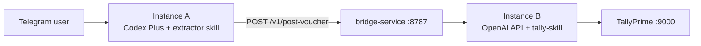

# TallyPrime (CA) Skill

Connect to a **locally running** TallyPrime instance via its **XML-over-HTTP** interface. All requests are HTTP POST to `$TALLY_URL` (commonly `http://localhost:9000`) with an XML body.

- **No cloud API**: TallyPrime must be open/running on the user’s machine.
- **Multi-company**: Always use the correct `SVCURRENTCOMPANY` (exact spelling).

## Hero Use Case: Bridge JSON → Tally entry

This skill receives **pre-extracted invoice data** as a canonical JSON payload from the bridge service (see `reference/bridge-input.md` for schema). PDF/image extraction is handled by a separate **tally-extractor-skill** running on Instance A.

Goal: zero manual entry for CAs handling many clients.

1. Receive validated JSON payload from bridge (company, party, GSTIN, date, invoice no, items, taxes, total).
2. Ensure masters exist: party ledger, purchase/sales ledger, GST ledger(s), bank/cash ledger (if needed).
3. Post voucher with a **unique GUID** (the `idempotency_key` from the JSON).
4. Return structured result to the bridge for relay to the user.

**Important:** This skill does **not** parse PDFs or images. All document extraction happens on Instance A (`tally-extractor-skill`). This skill only processes structured JSON input via the bridge HTTP endpoint.

## PDF Generation from Text (Invoice / Receipt)

When the user asks to **generate a PDF** from invoice data or any text message, use the `tallyca` CLI. This converts raw WhatsApp/Telegram text directly into a professional GST-compliant PDF.

**Important:** Always produce the file **only** via `tallyca`. Do **not** invent HTML/PDF with the model when `tallyca` fails — fix the environment (below) or set `TALLYCA_PDF_BACKEND=pdfmake` and retry.

### One-time setup (run once per environment)

```bash
npm install -g tallyca
```

### Minimum `tallyca` CLI version (OpenClaw must stay current)

OpenClaw **does not** auto-discover new npm releases. Whatever was installed with `npm install -g tallyca` stays until someone runs an upgrade command.

**Required for this skill’s PDF flows:** `tallyca` **>= 1.0.1** (semver). Features such as Playwright + pdfmake fallback and `TALLYCA_PDF_BACKEND` assume this baseline.

When you publish a newer **breaking** or **must-have** CLI release, **edit this line** in `SKILL.md` to the new minimum and redeploy the skill so agents reinstall if needed.

**Preflight (before generating a PDF):**

1. Run `tallyca --version` (output looks like `tallyca/1.0.1 …`). Compare the numeric version to the minimum above.
2. If `tallyca` is missing or older than the minimum, run:

   ```bash
   npm install -g tallyca@latest
   ```

   Or pin exactly: `npm install -g tallyca@1.0.1`.

3. **Optional** (only if npm registry is reachable): compare registry vs installed:

   ```bash
   npm view tallyca version
   ```

   If the registry version is newer **and** you want the latest fixes, run `npm install -g tallyca@latest`, then re-check `tallyca --version`.

**Note:** The `version:` field at the top of this file is the **skill document** version, not the `tallyca` package version.

### PDF rendering on servers (AWS / Linux / minimal images)

`tallyca` tries **Playwright + Chromium** first (matches the HTML templates). If Chromium cannot start (common errors: missing `libatk-1.0.so.0`, “failed to launch browser”, missing GTK/GBM libs), it **automatically falls back** to **pdfmake** (pure JavaScript, no browser). You can control this with **`TALLYCA_PDF_BACKEND`**:

| Value | Behavior |
|-------|----------|
| `auto` (default) | Playwright first; on typical Chromium failures, use pdfmake |
| `playwright` | Playwright only — fails if Chromium/libs missing |
| `pdfmake` | Skip Chromium — always pdfmake (best on locked-down serverless/AWS without apt/yum) |

**Recommended on AWS when Playwright errors appear:**

```bash
export TALLYCA_PDF_BACKEND=pdfmake
```

Then run the same `tallyca from-text` / `generate:invoice` commands as usual.

**If you can install OS packages** (full EC2/container with sudo), install Chromium dependencies and browsers so Playwright works:

**Amazon Linux 2 / AL2023**

```bash
sudo yum install -y \
  alsa-lib atk at-spi2-atk cups-libs libdrm libXcomposite \
  libXdamage libXrandr mesa-libgbm pango gtk3
npx playwright install chromium
npx playwright install-deps chromium
```

**Ubuntu / Debian**

```bash
sudo apt-get update
sudo apt-get install -y \
  libatk1.0-0 libatk-bridge2.0-0 libcups2 libdrm2 \
  libxcomposite1 libxdamage1 libxrandr2 libgbm1 \
  libpango-1.0-0 libcairo2 libasound2 libatspi2.0-0
npx playwright install chromium
npx playwright install-deps chromium
```

### Generate invoice PDF from raw WhatsApp text

Pass the user's message directly to `tallyca from-text`:

```bash
tallyca from-text \
  --company "ABC Company" \
  --text "Party Name: XYZ Party
Invoice No.: 186
Date: 2/1/2026
Item: PQR Item 2523 @ 18 %
Qty: 140 Bag
Rate: 279.66/Bag
HSN Code: 25322210
Amount: 39152.40
Make sure to use voucher class Sales @ 18 %" \
  --output invoice_186.pdf
```

The parser auto-extracts: party name, invoice number, date, item details, HSN, quantity, rate, tax rate, amount, and voucher class.

### Generate invoice PDF with structured flags

When you have already extracted the fields:

```bash
tallyca generate:invoice \
  --company "ABC Company" \
  --party "XYZ Party" \
  --invoice-no 186 \
  --date "2/1/2026" \
  --item "PQR Item|140 Bag|279.66|18%|25322210" \
  --voucher-class "Sales @ 18 %" \
  --output invoice_186.pdf
```

Item format: `Description|Qty Unit|Rate|Tax%|HSN` (pipe-separated). Use `--item` multiple times for multiple line items.

### Generate generic PDF (receipts, notes)

```bash
tallyca generate:generic \
  --title "Payment Receipt" \
  --body "Payment of ₹39152.40 received from XYZ Party against Invoice 186." \
  --output receipt.pdf
```

### Commands summary

| Command | Use case |
|---|---|
| `tallyca from-text --text "..." --output x.pdf` | Auto-detect type from raw text |
| `tallyca generate:invoice --party "..." --item "..." --output x.pdf` | Structured invoice data |
| `tallyca generate:generic --title "..." --body "..." --output x.pdf` | Receipts, notes, any text |

### Workflow: User asks for PDF

1. User sends invoice details via WhatsApp/Telegram
2. Check if `tallyca` is installed: `which tallyca` / `where tallyca` (Windows) or `tallyca --version`
3. Run **`tallyca --version`** and confirm it meets **Minimum `tallyca` CLI version** above. If missing or too old: `npm install -g tallyca@latest` (or the pinned version), then verify again.
4. **Optional:** Run `npm view tallyca version` if you need to confirm whether a newer CLI exists on npm before upgrading.
5. Run `tallyca from-text` with the user's message as `--text` (and `--company` / `--output` as needed)
6. If the command fails with Chromium/browser/library errors on Linux/AWS: set `TALLYCA_PDF_BACKEND=pdfmake` for that shell session (or install OS + Playwright deps above), then **retry the same `tallyca` command**. Do not substitute a hand-built PDF from the model.
7. Return the generated PDF file from `tallyca` to the user

### Maintainer / release discipline (`tallyca` npm package)

When you ship a **new `tallyca` version** that this skill depends on (new flags, breaking PDF behavior, or required bugfixes):

1. Publish **`tallyca`** to npm (`tally-pdf-cli` package).
2. Update **Minimum `tallyca` CLI version** in this section if the skill requires that release (especially majors or breaking flags).
3. Bump this **`SKILL.md` frontmatter `version`** when you redistribute the skill bundle so teams know the doc changed.

That way OpenClaw instructions and the installed CLI stay aligned; the agent only “knows” about new versions through **this documented minimum + upgrade commands**, not automatically.


## When to use this skill

**Scope note:** This skill is for **Instance B** (Tally Poster). It does **not** parse PDFs or images — that responsibility belongs to `tally-extractor-skill` on Instance A. This skill receives structured JSON from the bridge and posts to TallyPrime.

Use when:

- Receiving JSON payloads from the bridge (`/v1/post-voucher`) — validate and post to Tally
- **Generate PDF**: create invoice PDF, receipt PDF, or any document from text/data (use `tallyca` CLI)
- Post entries: purchase, sales, receipt, payment, journal, contra, credit note, debit note
- Check reports: day book, trial balance, balance sheet, profit & loss, ledger statement, outstandings, GST
- Manage masters: create/alter ledgers, groups, stock items/UOM (inventory clients)
- Fix data: alter or cancel a voucher

For any Tally/accounting task, **always follow this skill and its `reference/` templates**. Do not create XML payloads from scratch for known flows; use the documented template that matches the task and only replace the required placeholders. If the required task is not documented, first read `SKILL.md` and all relevant files in `reference/` thoroughly; if no documented template/workflow exists, clearly tell the user that this skill cannot perform that task yet and do not attempt it.

Responses to users must be written for accountants, not developers. After Tally calls, do **not** mention XML, payloads, HTTP, server responses, status codes, raw API output, or integration internals unless the user explicitly asks for technical details. Say “Tally is connected” instead of “server is running”; say “Entry posted” or “Entry updated” instead of “XML import succeeded”; then summarize the company name, voucher type, date, party/ledger names, amount, tax split, narration, and any masters created or missing.

## Critical rules (must follow)

1. **Never assume company**: if not explicit, ask which company to use before posting.
2. **Never guess ledgers**: verify ledgers exist before voucher import; create missing masters first.
3. **Dates are `YYYYMMDD`** (no separators).
4. **Idempotency**: always set a stable unique `GUID` per voucher to prevent duplicates on retries.
5. **Balance vouchers**: total debits must equal total credits (Tally error: “Voucher totals do not match!”).
6. **Escape XML**: narration/party names may contain `&` → use `&amp;` in XML.
7. **Posting is write operation**: confirm intent (and company) before any create/alter/cancel.
8. **Prefer bill-wise allocations** for party ledgers to keep outstandings correct (see `reference/vouchers.md`).
9. **Accounting-only vouchers (no inventory items)**: set `<ISINVOICE>No</ISINVOICE>` and place the **party ledger entry first** in the `ALLLEDGERENTRIES.LIST` sequence. This makes the Day Book "Particulars" column show the party name (not the expense/purchase ledger) and defaults the voucher to the clean "As Voucher" view. Only use `ISINVOICE=Yes` for item invoices that go through `reference/inventory.md`.
10. **Accounting Invoice Mode — always use `LEDGERENTRIES.LIST`**: when `OBJVIEW="Invoice Voucher View"` is set (Modes 1 and 2 in `reference/vouchers.md`), every ledger block **must** use `<LEDGERENTRIES.LIST>`, not `<ALLLEDGERENTRIES.LIST>`. Tally silently ignores `ALLLEDGERENTRIES` in this view, causing the voucher to be saved with no entries and the error "No accounting or inventory entries are available."
11. **Voucher class decision — confirm before posting**: before posting any Purchase or Sales voucher, check whether the company's voucher type uses a class for GST splitting. Run the preflight checklist in the "Preflight checklist before posting" section below. If class mode is confirmed, set `<CLASSNAME>EXACT_CLASS_NAME</CLASSNAME>` in the voucher header and include all four GST header fields (`CMPGSTIN`, `PARTYGSTIN`, `GSTREGISTRATIONTYPE`, `PLACEOFSUPPLY`). **If class existence is unconfirmed, stop and ask — do not post without it.** Full decision rules and templates are in the "Voucher class — decision rules" section of `reference/vouchers.md`.

## Preflight checklist before posting

Run through every item before sending any Create/Alter/Delete request. **Stop at the first unresolved item and ask the user.**

| # | Check | How to verify | Block if… |
|---|---|---|---|
| 1 | **Company confirmed** | User stated it explicitly | Name not given — ask |
| 2 | **Server reachable** | `curl -s --max-time 5 "$TALLY_URL"` | No response / wrong port |
| 3 | **Voucher type uses a class?** | Export voucher type masters or ask user | Unknown — ask before posting |
| 4 | **Class name confirmed** (if class mode) | List voucher type via masters export; match exact class name in Tally | Class not found — ask, never guess |
| 5 | **Party ledger exists** | Ledger existence check (`reference/masters.md`) | Missing — create first |
| 6 | **Purchase/Sales/GST ledgers exist** | Same as above | Missing — create first |
| 7 | **GST header fields available** (if class mode) | `CMPGSTIN`, `PARTYGSTIN`, `GSTREGISTRATIONTYPE`, `PLACEOFSUPPLY` | Any missing — ask user |
| 8 | **Voucher totals balance** | Sum all `AMOUNT` values = 0 | Mismatch — fix before posting |

## Step 0: Check TallyPrime server

```bash
curl -s --max-time 5 "$TALLY_URL"
```

Expected (example):

```xml
<RESPONSE>TallyPrime Server is Running</RESPONSE>
```

If not running, stop and ask user to open TallyPrime and enable integrations for the port.

## Step 1: Company context

If the user did not specify company, ask. If they did, use **exact** name in `SVCURRENTCOMPANY`.

To list companies, use the template in `reference/reports.md` (“Company list”).

## Step 2: Verify/create required ledgers (masters)

Ledger existence checks and master creation templates are in `reference/masters.md` (includes ledgers, groups, GST/address fields, and party ledger creation with required field prompts).

**New company?** Run the "New Company Setup — Standard GST Ledgers" block in `reference/masters.md` first. It creates the seven minimum ledgers every GST-registered company needs:

| # | Ledger | Type |
|---|---|---|
| 1 | `Input Sgst @ 9 %` | Input GST |
| 2 | `Input Cgst @ 9 %` | Input GST |
| 3 | `Input IGST @ 18 %` | Input GST |
| 4 | `Purchase @ 18 %` | Purchase ledger |
| 5 | `Round Off` | Rounding |
| 6 | `Output Sgst @ 9 %` | Output GST |
| 7 | `Output Cgst @ 9 %` | Output GST |

Quick group defaults (common CA mapping):

| Ledger type | Parent group |
|---|---|
| Customer | `Sundry Debtors` |
| Vendor | `Sundry Creditors` |
| Sales | `Sales Accounts` |
| Purchases/Expenses | `Purchase Accounts` / `Direct Expenses` / `Indirect Expenses` |
| Bank | `Bank Accounts` |
| Cash | `Cash-in-Hand` |
| GST | `Duties & Taxes` |

## Step 3: Post vouchers (core)

Use `REPORTNAME=Vouchers` and always include `GUID`, `DATE`, and `VOUCHERTYPENAME`. Full templates (including bill-wise allocations, returns, contra) are in `reference/vouchers.md`.

Supported voucher types in this skill:

- Purchase, Sales, Payment, Receipt, Journal
- Credit Note, Debit Note
- Contra
- Voucher Alteration + Cancellation

## Read reports (core)

Use `TALLYREQUEST=Export` / `REPORTNAME=...` with `SVEXPORTFORMAT=$$SysName:XML`. Full templates are in `reference/reports.md`.

Common CA reports:

- **Voucher Register** — fetch all vouchers or filter by type (Payment/Receipt/Contra/etc.) for a date range — use for banking transaction extracts
- Day Book (period)
- Trial Balance (period)
- Balance Sheet
- Profit and Loss
- Ledger Names — fetch all ledger names before mapping/posting entries
- Ledger Vouchers (ledger statement)
- Bills Receivable / Bills Payable (outstandings)
- Ledger Outstandings / Group Outstandings
- GST: GSTR-1 and related summaries (plus GSTR-3B where available)
- Stock Summary (inventory clients)

## Suggested GUID pattern

Use a deterministic pattern when invoice number exists:

```
{companyShort}-{voucherType}-{voucherNumber}-{date}
```

Examples:

- `abc-purchase-ril2026-00123-20260115`
- `abc-creditnote-cn09-20260302`

## Multi-company CA workflow (recommended)

1. Capture company name early (and confirm spelling).
2. Validate connectivity.
3. Fetch required ledgers/masters or create them.
4. Only then post the voucher.
5. Reply with: company, voucher type, voucher number, date, amount breakdown, and whether any masters were created.

## Bank Statement Import

When importing bank statement transactions (PDF/Excel from bank), use the mapping guide and templates in `reference/vouchers.md` → "Bank Statement Import Workflow". Covers:

- Mapping bank entries to Receipt/Payment/Contra vouchers
- Ledger selection rules (debits, credits, expenses)
- Before posting, fetch all ledger names using `reference/reports.md` → "Ledger Names (all ledgers)" and confirm once with the user: “These are the ledgers I will use for the bank entries: ...”. Do not post until the user confirms the ledger mapping.
- Full XML templates for common bank transactions (NEFT, RTGS, UPI, charges)

## Bridge input contract

When receiving JSON from the bridge service (`/v1/post-voucher`), this skill expects a canonical JSON payload. Full schema and per-voucher-type required fields are documented in `reference/bridge-input.md`.

Key mapping rules (JSON → Tally XML):

| JSON field | Tally XML element | Notes |
|---|---|---|
| `voucher.date` (`YYYY-MM-DD`) | `DATE` (`YYYYMMDD`) | Remove dashes |
| `voucher.type` | `VOUCHERTYPENAME` | Exact enum match |
| `voucher.is_invoice_mode=true` | `OBJVIEW="Invoice Voucher View"` | Use `LEDGERENTRIES.LIST` (rule 10) |
| `voucher.voucher_class` | `CLASSNAME` | Exact spelling from Tally |
| `voucher.bill_allocations[]` | `BILLALLOCATIONS.LIST` | Nested under party ledger entry |
| `idempotency_key` | `GUID` | Used for deduplication |

When processing bridge input:

1. Validate JSON against schema in `reference/bridge-input.md`
2. Run the preflight checklist (section above)
3. Create missing masters if needed
4. Build XML using templates in `reference/vouchers.md`
5. Return result: `{status, guid, voucher_number, summary, masters_created[]}`

If any required field is missing or invalid, return `needs_clarification` with the missing field names — do not invent data.

## Deployment topology

Instance B is the **Tally Poster**. It does not expose Telegram or WhatsApp. All user chat happens on Instance A; B only receives JSON via `bridge-service`.



| Environment | Where B runs | Tally URL | Bridge exposure |
|---|---|---|---|
| **Production** | Client mini-PC with TallyPrime | `http://localhost:9000` | `ngrok http 8787` (or Cloudflare Tunnel) |
| **Dev** | Same EC2 as A (second OpenClaw) | ngrok URL to dev Tally | `localhost:8787` or ngrok |

**Production:** No ngrok needed for Tally — only the bridge port is tunneled inbound for A.

**Dev:** Both OpenClaws on one Ubuntu EC2; B uses your existing Tally ngrok URL in `TALLY_URL`.

## Instance B configuration checklist

| Step | Setting | Value |
|---|---|---|
| 1 | Host | Client mini-PC (prod) or same EC2 (dev) |
| 2 | Install | Node.js, OpenClaw, `npm install -g tallyca`, Tally OS deps (see PDF section) |
| 3 | LLM | OpenAI **API key** (per-client billing) |
| 4 | Skill loaded | `tally-skill/` only — **do not** load `tally-extractor-skill/` |
| 5 | `TALLY_URL` | `http://localhost:9000` (prod) or dev ngrok Tally URL |
| 6 | `TALLYCA_PDF_BACKEND` | `auto` or `pdfmake` on headless Linux |
| 7 | Bridge | `cd bridge-service && npm i && node server.js` on port 8787 |
| 8 | Tunnel | `ngrok http 8787` — give URL + bearer + HMAC secret to Instance A team |
| 9 | **Do not set** | `BRIDGE_URL` on Instance B (bridge is the server, not a client) |
| 10 | OpenClaw adapter | `OPENCLAW_MODE=cli` or `http` per your install |
| 11 | Health | From A: `GET $BRIDGE_URL/v1/health` must return `tally: ok` before posting |

## Advanced reference

- **Bridge input schema**: `reference/bridge-input.md`
- Reports and data export: `reference/reports.md`
- Voucher templates (including Debit/Credit Note, Contra, bill-wise allocations, alter/cancel): `reference/vouchers.md`
- Masters (ledgers/groups + GST/address, alteration): `reference/masters.md`
- Inventory (stock groups/items/UOM, item invoices): `reference/inventory.md`
- Error handling and troubleshooting: `reference/errors.md`